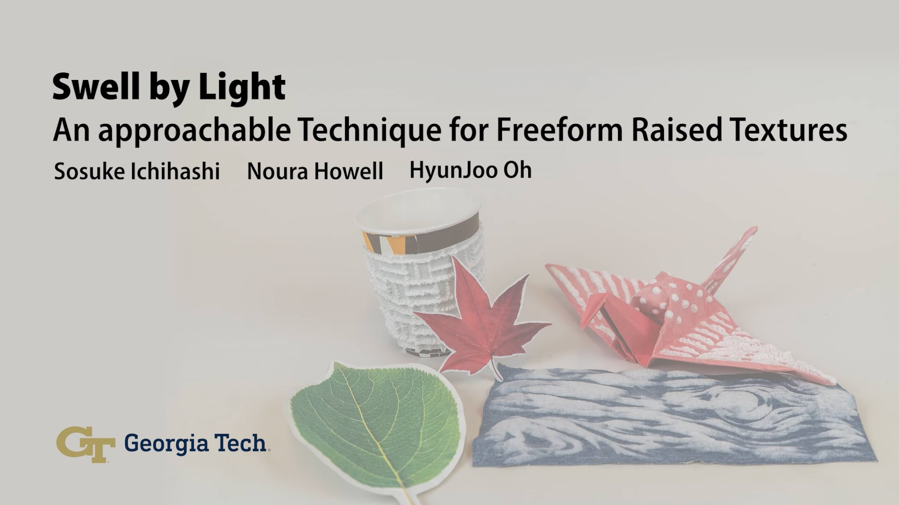

<p align="left">
🔤 <a href="#english">English</a> | 🇯🇵 <a href="#日本語">日本語</a>
</p>

---



## English

# **``🐐 sbl-optimizer``** Advanced Colab<br> Pattern Optimizer for [Swell by Light](https://sites.gatech.edu/futurefeelings/2025/03/07/swell-by-light-tei-25/)
[](https://colab.research.google.com/drive/1KX5W0MG34zS_qX7RqeMLizrkhlWp8ojh?usp=sharing)

[](LICENSE)
[](https://badge.fury.io/py/sbl-optimizer)
[](https://github.com/sosucat/sbl-optimizer)

[](https://sites.gatech.edu/futurefeelings/2025/03/07/swell-by-light-tei-25/)
[](https://sosuke-ichihashi.com/)
[](https://doi.org/10.1145/3689050.3704420)
[](https://sites.gatech.edu/futurefeelings/2025/07/23/make-puffy-patterns-with-light/)
[](https://youtu.be/LomVS_jHxl0?feature=shared)

Welcome to **sbl-optimizer**, a tool optimizing your pattern images for 2.5D texture fabrication!
**This notebook is an advanced version** walking through all the codes.
If you just want to use sbl-optimizer without minding the coding, check out the simplified Colab notebook:

[](https://colab.research.google.com/drive/1Kpvq15wZrzsnQI28_JfkDSqCwT1ouyxj?usp=sharing)

---


Optimization of the printed pattern results in a uniform temperature distribution (right) closely matching the original pattern (left). In this example, the leaves are over-heated while the stems are under-heated before the optimization. As the iteration number goes up, the leaves' temperature goes down while the stems' goes up, resulting in a more uniform temperature distribution.

---


# Credits & License
## License
>This project is licensed under the [MIT License](LICENSE).


## Developer
>Sosuke Ichihashi

> [](https://sosuke-ichihashi.com/)
[](https://github.com/sosucat)
[](https://x.com/refreshsource)


## Cite this work
> If you use **sbl-optimizer** in your research or projects, please cite:
* Sosuke Ichihashi, Noura Howell, and HyunJoo Oh. 2025.\
Swell by Light: An Approachable Technique for Freeform Raised Textures. \
In Proceedings of the Nineteenth International Conference on Tangible, Embedded, and Embodied Interaction (TEI '25). Association for Computing Machinery, New York, NY, USA, Article 45, 1–16. https://doi.org/10.1145/3689050.3704420
```bibtex
@inproceedings{10.1145/3689050.3704420,
author = {Ichihashi, Sosuke and Howell, Noura and Oh, HyunJoo},
title = {Swell by Light: An Approachable Technique for Freeform Raised Textures},
year = {2025},
isbn = {9798400711978},
publisher = {Association for Computing Machinery},
address = {New York, NY, USA},
url = {https://doi.org/10.1145/3689050.3704420},
doi = {10.1145/3689050.3704420},
booktitle = {Proceedings of the Nineteenth International Conference on Tangible, Embedded, and Embodied Interaction},
articleno = {45},
numpages = {16},
keywords = {2.5D fabrication, Personal fabrication, tactile rendering},
location = {Bordeaux / Talence, France},
series = {TEI '25}
}
```


---

## 日本語

# ``🐐 sbl-optimizer`` 上級版Colab<br>[Swell by Light](https://sites.gatech.edu/futurefeelings/2025/07/03/swell-by-light-tei-25-2/)用の模様最適化
[](https://colab.research.google.com/drive/1GLLGjPD7EhUV6evPHUeh6qHe3aNMV47u?usp=sharing)

[](LICENSE)
[](https://badge.fury.io/py/sbl-optimizer)
[](https://github.com/sosucat/sbl-optimizer?tab=readme-ov-file#sbl-optimizer-%E6%97%A5%E6%9C%AC%E8%AA%9E)

[](https://sites.gatech.edu/futurefeelings/2025/07/03/swell-by-light-tei-25-2/)
[](https://sosuke-ichihashi.com/)
[](https://doi.org/10.1145/3689050.3704420)
[](https://sites.gatech.edu/futurefeelings/2025/07/23/%e5%85%89%e3%81%a7%e3%83%87%e3%82%b3%e3%83%9c%e3%82%b3%e3%82%82%e3%82%88%e3%81%86%e3%82%92%e4%bd%9c%e3%82%8d%e3%81%86%ef%bc%81/)
[](https://youtu.be/LomVS_jHxl0?feature=shared)

**sbl-optimizer** は、Swell by Lightで画像に忠実なデコボコ模様を作るため、画像の濃淡を修正するソフトです。

**本ノートは上級者向け**なので、sbl-optimizerライブラリをPython環境で利用して模様画像を最適化する方法の詳細を理解できます。

**sbl-optimizerをパッと使いたいだけの方は、以下の簡易版をおすすめ**します。
簡易版では、プログラミングの知識がなくても、画像をアップロードしてセルを実行するだけで、最適化された画像を作ることができます。できあがった画像を印刷し、光を当てると、元画像の模様と同じようなデコボコ模様ができあがります。

[](https://colab.research.google.com/drive/15zYmaNvh88jztUcqpzwLXtT4YMRk2i1G?usp=sharing)

---


画像の模様の濃淡を最適化することで、画像の模様（左）に近い、均一な温度分布（右）になり、画像に近いきれいなデコボコ模様ができます。
この例では、最適化前（iteration: 0）は葉の部分が熱くなりすぎている一方で、茎の部分は加熱不足の状態でした。
最適化が進むにつれて、葉の温度は下がり、茎の温度は上昇していき、結果としてより均一な温度分布が実現されています。

---

# クレジットとライセンス

## ライセンス
>このプロジェクトは [MIT ライセンス](LICENSE) のもとで公開されています。

## 開発者
>Sosuke Ichihashi

> [](https://sosuke-ichihashi.com/)  
[](https://github.com/sosucat)  
[](https://x.com/refreshsource)

## 論文の引用方法
> 本プロジェクト **sbl-optimizer** を研究や制作に活用された場合は、以下の文献を引用してください：

* Sosuke Ichihashi, Noura Howell, and HyunJoo Oh. 2025.\
Swell by Light: An Approachable Technique for Freeform Raised Textures.\
In Proceedings of the Nineteenth International Conference on Tangible, Embedded, and Embodied Interaction (TEI '25). Association for Computing Machinery, New York, NY, USA, Article 45, 1–16. https://doi.org/10.1145/3689050.3704420

```bibtex
@inproceedings{10.1145/3689050.3704420,
author = {Ichihashi, Sosuke and Howell, Noura and Oh, HyunJoo},
title = {Swell by Light: An Approachable Technique for Freeform Raised Textures},
year = {2025},
isbn = {9798400711978},
publisher = {Association for Computing Machinery},
address = {New York, NY, USA},
url = {https://doi.org/10.1145/3689050.3704420},
doi = {10.1145/3689050.3704420},
booktitle = {Proceedings of the Nineteenth International Conference on Tangible, Embedded, and Embodied Interaction},
articleno = {45},
numpages = {16},
keywords = {2.5D fabrication, Personal fabrication, tactile rendering},
location = {Bordeaux / Talence, France},
series = {TEI '25}
}
